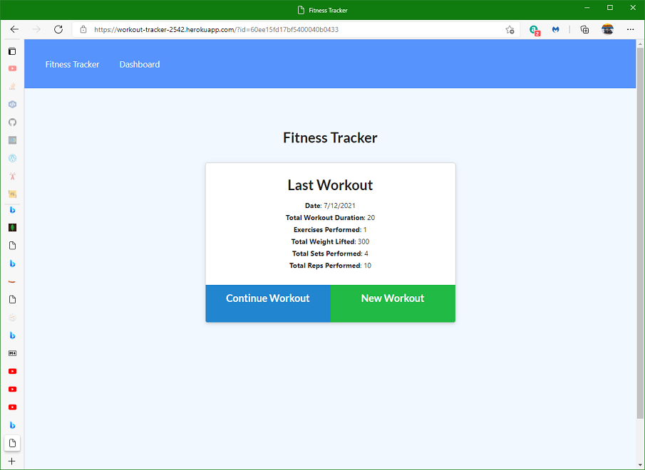
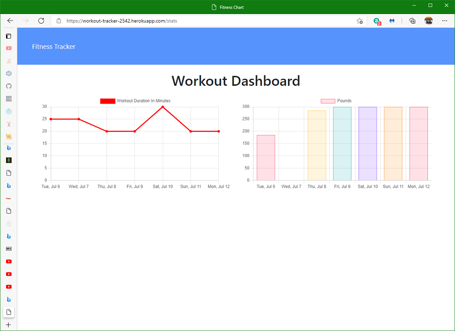

heroku run node seeders/seed.js

# Workout Tracker
## Description
Workout Tracker is a web app to view create and track daily workouts. It uses npm packages Node, Express, Mongoose and JavaScript for the backend. It uses HTML, CSS and Javascript for the frontend.

A workout 'document" has a day and one or more exercises. There are two types of exercises, cardio (such as running) and weightlifting. The dashboard shows total duration and weight lifted of the the last 7 workouts.

This app was deployed onto Heroku.com at this address.
[Link to the Workout Tracker app on Heroku.com](https://workout-tracker-2542.herokuapp.com/)

## Table of Contents (Optional)
If your README is long, add a table of contents to make it easy for users to find what they need.
- [Installation](#installation)
- [Usage](#usage)
- [Credits](#credits)
- [License](#license)

## Installation
To install this app on your PC clone from this GitHub repo
[Link to the Workout Tracker source code on GitHub](https://github.com/minprocess/18-Workout-Tracker)

Install dependencies with 
`npm i`

You can seed the MongoDB on your local PC using the node command
`node seeders/seed.js`

If you create an app on Heroku.com you may want to seed the data base with following Heroku CLI command
`heroku run node seeders/seed.js`

## Usage

On the homepage the user is able to:

  * Add exercises to the most recent workout plan.

  * Add new exercises to a new workout plan.
  
  The statistics of the last workout are shown.  

On the Dashboard the user is able to

  * View the combined weight of multiple exercises from the past seven workouts on the `stats` page.

  * View the total duration of each workout from the past seven workouts on the `stats` page.

## MIT License

Copyright (c) 2021 William Pate

Permission is hereby granted, free of charge, to any person obtaining a copy
of this software and associated documentation files (the "Software"), to deal
in the Software without restriction, including without limitation the rights
to use, copy, modify, merge, publish, distribute, sublicense, and/or sell
copies of the Software, and to permit persons to whom the Software is
furnished to do so, subject to the following conditions:

The above copyright notice and this permission notice shall be included in all
copies or substantial portions of the Software.

THE SOFTWARE IS PROVIDED "AS IS", WITHOUT WARRANTY OF ANY KIND, EXPRESS OR
IMPLIED, INCLUDING BUT NOT LIMITED TO THE WARRANTIES OF MERCHANTABILITY,
FITNESS FOR A PARTICULAR PURPOSE AND NONINFRINGEMENT. IN NO EVENT SHALL THE
AUTHORS OR COPYRIGHT HOLDERS BE LIABLE FOR ANY CLAIM, DAMAGES OR OTHER
LIABILITY, WHETHER IN AN ACTION OF CONTRACT, TORT OR OTHERWISE, ARISING FROM,
OUT OF OR IN CONNECTION WITH THE SOFTWARE OR THE USE OR OTHER DEALINGS IN THE
SOFTWARE.
